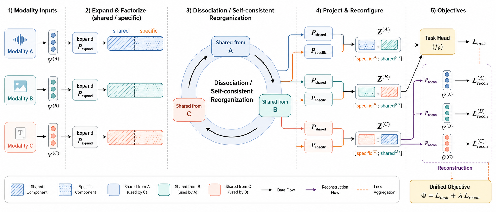
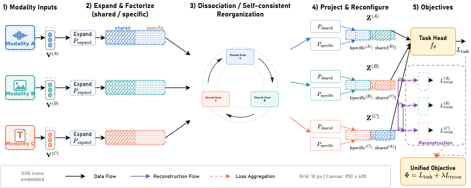
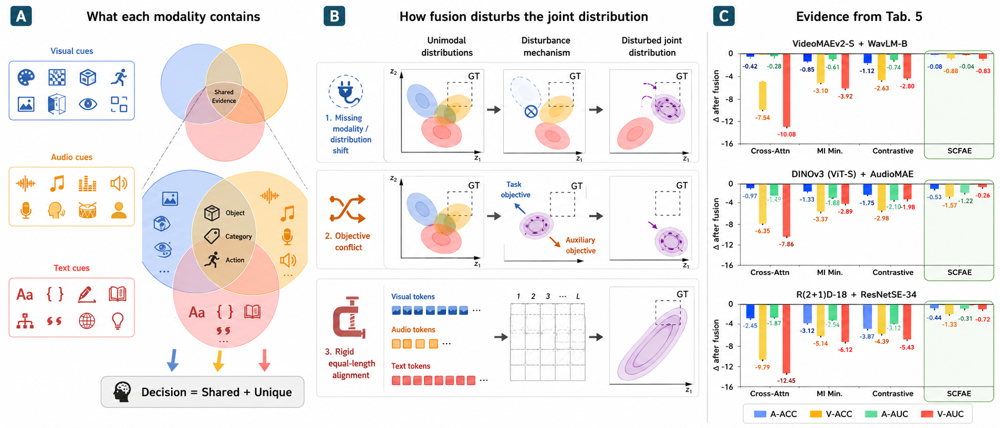
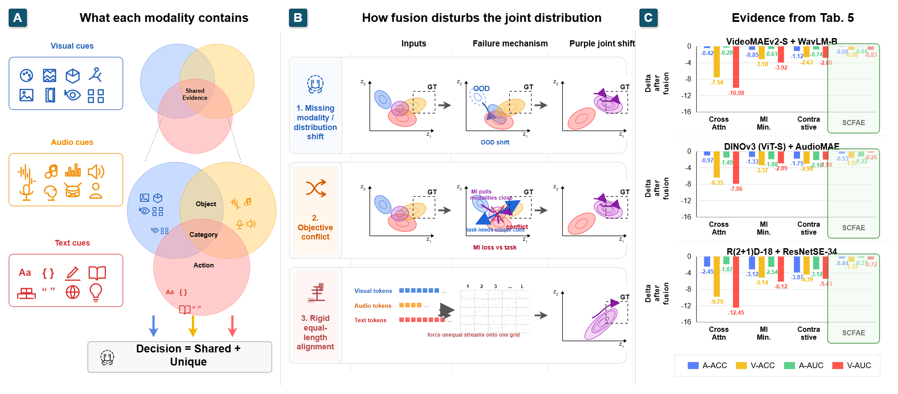

# YuInst Canvas Draw.io Skill

`yuinst-canvas-drawio-skill` is a Codex skill for reconstructing and creating editable scientific figures with a grid-first draw.io workflow.

The skill treats draw.io as the editable canvas for layout, labels, equations, panel badges, arrows, and simple shapes. Dense visual content such as icons, distributions, overlap diagrams, mechanism sketches, and chart tiles is generated as bounded SVG and embedded into the editable draw.io page.

## Source Figures

The demo reference figures are reconstructed from the paper:

Jiayu Xiong, Jing Wang, Jun Xue, Wanlong Wang, Jianlong Kwan, Xiaosen Lyu, and Zhouqiang Jiang. "Multimodal Fusion via Self-Consistent Task-Gradient Fields." arXiv:2410.15475. ICML 2026 accepted paper.

Paper link: https://arxiv.org/abs/2410.15475

The reference images are included only as visual reconstruction targets for demonstrating the skill workflow.

## Ref/Result Comparison

### Method Flowchart Demo

| Reference (`ref.png`) | Editable reconstruction export (`result.png`) |
| --- | --- |
|  |  |

### Teaser Figure Demo

| Reference (`ref.png`) | Editable reconstruction export (`result.png`) |
| --- | --- |
|  |  |

## Core Workflow

Each demo follows the same artifact chain:

```text
ref.png -> result.drawio -> result.png
```

Use `ref.png` as the visual target, generate SVG tiles for dense content, compose `result.drawio` with editable text and grid-based draw.io geometry, then export `result.png` as a preview.

The skill also provides the requirements for generating a useful `ref.png`. In other words, it can produce a `ReferenceBrief` before reconstruction: a prompt for the visual reference, plus the expected canvas, grid, panels, tile regions, editable text, and draw.io reconstruction plan.

## Reference Brief Examples

These prompts are reverse-engineered from the included demo `ref.png` files. They are meant to show the kind of reference-image requirements this skill can provide before building the editable draw.io result.

### Method Flowchart Reference Prompt

```text
Create a clean scientific methodology flowchart on a white background, wide landscape aspect, about 1900 x 800 px. Use five vertical stages separated by thin dashed gray dividers, with three repeated horizontal modality lanes.

Stage 1, Modality Inputs: show three input cards labeled Modality A, Modality B, and Modality C. Use distinct blue, teal, and coral accents. Each lane contains a modality icon, a compact vector token labeled V^(A), V^(B), or V^(C), and a simple rightward arrow.

Stage 2, Expand & Factorize (shared / specific): for each modality lane, show an Expand block labeled P_expand followed by a two-part horizontal component tile. The left half is shared with diagonal stripes; the right half is specific with dotted texture. Add small shared and specific labels above the first row.

Stage 3, Dissociation / Self-consistent Reorganization: place one large central circular mechanism spanning the three lanes. Use concentric circles, three rounded boxes around the ring labeled Shared from A, Shared from B, and Shared from C, and curved arrows rotating around the mechanism. Keep the title centered inside the ring.

Stage 4, Project & Reconfigure: for each lane, show P_shared and P_specific projection boxes merging into an output Z^(A), Z^(B), or Z^(C). Each output tile combines that lane's specific component with a shared component from the next modality. Use simple straight arrows and color-coded connectors.

Stage 5, Objectives: show a task head leading to L_task, plus a dashed reconstruction region with reconstructed vectors for A, B, and C leading to L_recon terms. Finish with a unified objective box, Phi = L_task + lambda L_recon.

Add a bottom legend explaining shared component, specific component, shared-from-A/B/C, data flow, reconstruction flow, and loss aggregation. Keep text readable, aligned, and suitable for later editable draw.io reconstruction. Avoid decorative backgrounds, freehand placement, 3D effects, and overlapping labels.

Expected reconstruction plan: keep stage headers, equations, lane labels, objective labels, legend labels, and global arrows editable in draw.io. Use bounded SVG tiles for input icons, component textures, the circular reorganization mechanism, and small repeated output components.
```

### Teaser Figure Reference Prompt

```text
Create a clean three-panel scientific teaser figure on a white background, wide landscape aspect, about 1900 x 830 px. Arrange panels left to right with badges A, B, and C in dark teal rounded squares. Use thin vertical separators and aligned panel titles.

Panel A, What each modality contains: build a concept panel explaining shared and unique evidence across visual, audio, and text modalities. On the left, stack three cue cards labeled Visual cues, Audio cues, and Text cues, each with small line icons and a matching color accent: blue for visual, orange for audio, red for text. In the center, show a large three-circle Venn diagram for shared evidence, and below it a zoomed Venn/overlap schematic containing shared semantic evidence such as object, category, and action. Add arrows from each modality circle to a bottom decision box reading Decision = Shared + Unique.

Panel B, How fusion disturbs the joint distribution: create a row-by-column mechanism grid with three disturbance rows and four columns. The rows are Missing modality / distribution shift, Objective conflict, and Rigid equal-length alignment. The columns are disturbance source, unimodal distributions, disturbance mechanism, and disturbed joint distribution. Use compact distribution plots with axes z1 and z2, dashed GT boxes, colored ellipses, arrows between columns, and row-level source icons. Keep the row layout consistent and grid-aligned.

Panel C, Evidence from Tab. 5: show three stacked compact bar-chart panels for VideoMAEv2-S + WavLM-B, DINOv3 (ViT-S) + AudioMAE, and R(2+1)D-18 + ResNetSE-34. Each chart compares Cross-Attn, MI Min., Contrastive, and SCFAE. Use four bar colors for A-ACC, V-ACC, A-AUC, and V-AUC, with negative delta values after fusion. Highlight the SCFAE column with a pale green rounded background and thin green outline. Include a compact legend at the bottom.

Keep the whole figure publication-style: readable labels, restrained colors, clear gutters, no photorealism, no decorative background, and no overlapping text. The reference should be detailed enough to reconstruct as editable draw.io panels.

Expected reconstruction plan: keep panel badges, titles, chart titles, row labels, column headers, callouts, and legends editable in draw.io. Use SVG tiles for modality cue cards, Venn/overlap diagrams, distribution panels, and bar charts.
```

## Repository Layout

```text
yuinst-canvas-drawio-skill/
  SKILL.md
  agents/openai.yaml
  references/
    drawio-composer-patterns.md
    method-flowcharts.md
    reconstruction-workflow.md
    ref-image-briefs.md
    teaser-figures.md
  scripts/
    matplotlib_svg_tile.py

method-flowchart-demo/
  ref.png
  result.drawio
  result.png
  compose-result.py
  input-tiles/
  component-tiles/
  scripts/

teaser-figure-demo/
  ref.png
  result.drawio
  result.png
  panel-a-concept.*
  panel-b-mechanism.*
  panel-c-evidence.tex
  update-panel-b.py
```

## Figure Classes

The skill routes work into one primary figure class:

- `method-flowchart`: staged method, algorithm, model pipeline, architecture, or lane-based process.
- `teaser-figure`: paper teaser, graphical abstract, multi-panel overview, concept/mechanism/evidence composition.

The detailed figure rules live in:

- `yuinst-canvas-drawio-skill/references/method-flowcharts.md`
- `yuinst-canvas-drawio-skill/references/teaser-figures.md`

## Requirements

The examples use Python plus common scientific plotting libraries:

```bash
python -m pip install matplotlib numpy seaborn
```

Open `.drawio` files with diagrams.net or draw.io-compatible tooling.

## Notes For Reuse

- Keep important text editable in draw.io.
- Use SVG tiles for dense local visuals.
- Keep tile outputs bounded and margin-free.
- Do not depend on `ref.png` as the final artifact.
- Prefer deterministic composer scripts over hand-positioned layouts.

## Acknowledgement

The author Jiayu Xiong would like to thanks his advisors Jing Wang, Qi Zhang, and his grandmother Xiaomao Wang.
